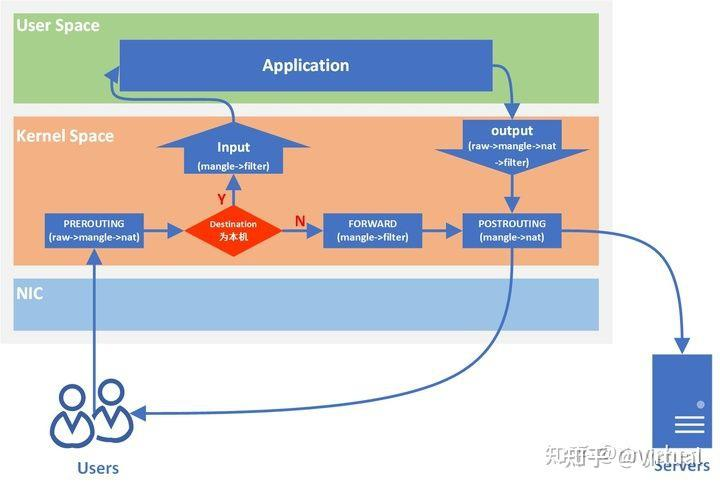
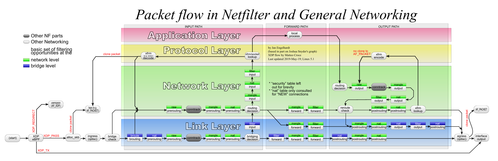
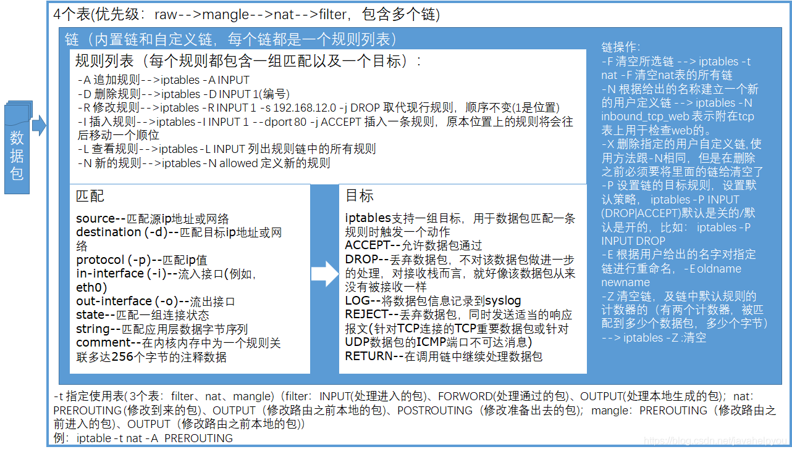
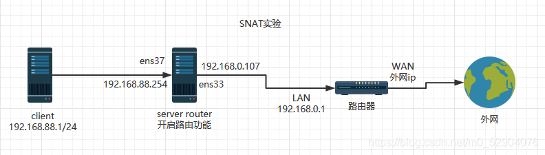
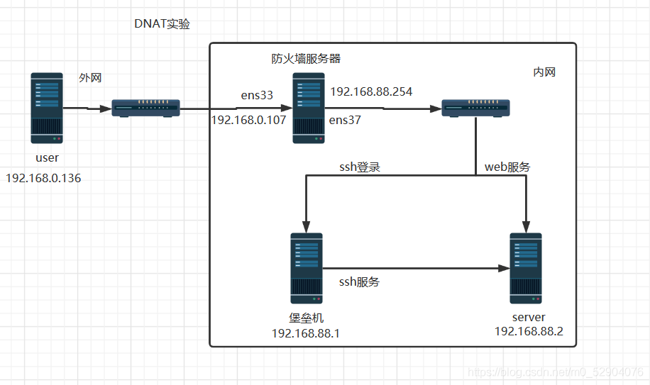
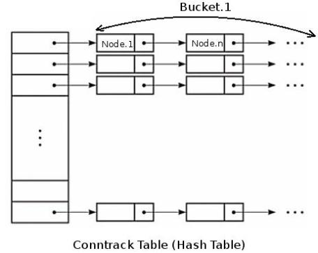

## iptables的使用

### 介绍

linux的netfilter内核模块可以对网络数据包进行处理，iptables是对这个内核模块进行配置的用户态工具。

linux收到数据包后，根据数据包的目的地址和路由规则，数据包会走不同的链，每个链包含4张表，每个表可以挂在不同的链上，iptables可以对任意一张表进行策略配置。



更详细的：



iptables的四个表`iptable_filter`，`iptable_mangle`，`iptable_nat`，`iptable_raw`，默认表是`filter`（没有指定表的时候就是filter表）

- `filter 表`：用来对数据包进行过滤，具体的规则要求决定如何处理一个数据包。
  对应的内核模块为：`iptable_filter`，其表内包括三个链：`input`、`forward`、`output`;
- `nat 表`：nat 全称：network address translation 网络地址转换，主要用来修改数据包的 IP 地址、端口号信息。
  对应的内核模块为：`iptable_nat`，其表内包括三个链：`prerouting`、`postrouting`、`output`;

> 对于一个tcpc链接来说，nat表匹配只会在链接的发起阶段出现（icmp也类似），因为四元组一旦在发起链接时确定好，后面就不需要再改了。
>
> 如果是作为服务端，只会在收到客户端的第一个syn包在PREROUTING的nat表上匹配一次，如果此时不改ip、端口，后面这个四元组就已经确定了，就不会再改了。
>
> 如果是作为客户端，只会在发出第一个syn包在OUTPUT链和POSTROUTING链上做nat表的匹配，因为对于一个链接来说，第一次发出包时不改ip、端口，就说明这个链接的四元组已经确定了，后面都不会再改了。
>
> 如果是作为转发端，只会在收到客户端的第一个包时在PREROUTING链做一次nat表的匹配，转发时，只会在转发第一个包时在POSTROUTING链上做nat表匹配。

- `mangle 表`：主要用来修改数据包的服务类型，生存周期，为数据包设置标记，实现流量整形、策略路由等。
  对应的内核模块为：`iptable_mangle`，其表内包括五个链：`prerouting`、`postrouting`、`input`、`output`、`forward`;
- `raw 表`：主要用来决定是否对数据包进行状态跟踪。
  对应的内核模块为：`iptable_raw`，其表内包括两个链：`output`、`prerouting`;

> raw表只使用在`PREROUTING`链和`OUTPUT`链上，因为优先级最高，从而可以对收到的数据包在系统进行ip_conntrack（连接跟踪）前进行处理。
>
> ip_conntrack使用类似c++ unordered_map来管理所有链接，数据包在进入nat模块后，首先判断这个包在不在conntrack中，如果不在，nat模块不会处理这个包直接放行。
>
> 一但用户使用了raw表，在某个链上，raw表使用NOTRACK处理完后，将跳过ip_conntrack和NAT表处理，即不再做数据包的链接跟踪和地址转换处理了。RAW表可以应用在那些不需要做nat的情况下，以提高性能。

iptables的五个链`PREROUTING`，`INPUT`，`FORWARD`，`OUTPUT`，`POSTROUTING`。

- `input 链`：当收到访问防火墙本机地址的数据包时，将应用此链中的规则；
- `output 链`：当防火墙本机向外发送数据包时，将应用此链中的规则；
- `forward 链`：当收到需要通过防火中转发给其他地址的数据包时，将应用此链中的规则，注意如果需要实现forward转发需要开启Linux内核中的ip_forward功能；
- `prerouting 链`：在对数据包做路由选择之前，将应用此链中的规则；
- `postrouting 链`：在对数据包做路由选择之后，将应用此链中的规则；

### 常用选项参数

```shell
iptables [ -t 表名] 命令选项 [链名] [条件匹配] [-j 处理动作或跳转]
```

-t 接表名，如果不加-t 默认就是 –t filter

命令选项

> -L	列出指定链中所有的规则，未指定链名，则列出表中的所有链
>
> -v	显示详细信息，包括每条规则的匹配句数量和匹配字节数
>
> -x	在v的基础上，禁止自动换算单位（K,M）
>
> -n	只显示ip地址和端口号，不显示域名和服务名称
>
> -I	在指定链中插入一条新规则，未指定序号时默认作为第一条规则
>
> -A	在指定链的末尾添加一条新的规则
>
> -D	删除指定链中的某一条规则，按规则序号或内容确定要删除的规则
>
> -R	修改、替换指定链中的某一条规则，可指定规则序号或具体内容
>
> -F	清空指定链中所有的规则，未指定链名，则清空表中的所有链
>
> -P	设置指定链指定表的默认策略，注意默认策略拒绝动作只能是DROP，而不能是REJECT
>
> -X	删除指定表中用户自定义的规则链
>
> --line-numbers	查看规则列表时，同时显示规则在链中的顺序号

条件匹配

> -i	入站请求接口
>
> -o	出站请求接口
>
> -s	入站源地址
>
> -d	目标地址
>
> -p	指定规则协议，如tcp, udp,icmp等，可以使用all来指定所有协议
>
> --dport	目的端口，数据包的目的（dport）地址是80，就是要访问我本地的80端口
>
> --sport	来源端口 数据包的来源端口是（sport）80，就是对方的数据包是80端口发送过来的。

可以对条件取反，在选项前加`!`即可

处理动作

> ACCEPT	允许数据包通过。
>
> DROP	直接丢弃数据包，不给任何回应信息，这时候客户端会感觉自己的请求泥牛入海了，过了超时时间才会有反应。
>
> REJECT	拒绝数据包通过，必要时会给数据发送端一个响应的信息，客户端刚请求就会收到拒绝的信息。--reject-with：可以设置提示信息，拒绝时的提示信息。当不设置任何值时，默认值为icmp-port-unreachable。
>
> SNAT	源地址转换，解决内网用户用同一个公网地址上网的问题。
>
> MASQUERADE	是SNAT的一种特殊形式，适用于动态的、临时会变的ip上。
>
> DNAT	目标地址转换。
>
> REDIRECT	在本机做端口映射。
>
> LOG	在/var/log/messages文件中记录日志信息，然后将数据包传递给下一条规则，也就是说除了记录以外不对数据包做任何其他操作，仍然让下一条规则去匹配
>
> MARK	打标。可以对某个报文多次打标，注意，后面的打标标记会覆盖掉前面打标的标记。
>
> RETURN	返回上一层链，如果是主链（iptables自带的5链之一），则使用主链的默认规则处理这个包。
>
> 一般不使用REJECT(拒绝)行为.REJECT会带来安全隐患

### 链中的匹配策略

1. 自上而下，按顺序匹配，需要注意的是，有三个动作会短路，提前结束这个链上的这个表的匹配，这三个动作分别是: ACCEPT 、REJECT、DROP（如果在某条链上调用自定义的链，在自定义的链上结束了这个表的匹配，就会结束这个链后续所有的匹配）；
2. 若在该链的表上找不到匹配的规则，则按该链的表上的默认策略处理。



### 匹配扩展

iptables匹配时，还可以使用很多扩展模块来增强匹配功能，详情见man手册

```shell
man iptables-extensions
```

### 配置的保存

使用iptables命令配置的规则，只能临时生效，重启了iptables服务，就会失效。如果想保存当前的iptables规则，在安装了iptables-services rpm包的centos7系统下，可以执行命令：

service iptables save

将当前iptables的规则保存到/etc/sysconfig/iptables，每次iptables服务重启，都会加载这个配置文件中的规则。

也可以执行：

iptables-save > xxx.txt

iptables-restore < xxx.txt

分别将iptables保存和恢复。

### 使用例子

#### SNAT和DNAT应用

- SNAT（Source Network Address Translation）
  源地址转换，根据指定条件修改数据包的源IP地址。
- DNAT（Destination Network Address Translation）
  目的地址转换，根据指定条件修改数据包的目的IP地址。

网关和防火墙就是靠这种机制实现的。

下面是一个配置例子：





上图中防火墙服务器和server router是同一台机器，需要在这台机器上进行如下操作：

```shell
# 开启路由功能
echo 1  > /proc/sys/net/ipv4/ip_forward

# 配置SNAT策略，实现snat功能，将所有192.168.88.0这个网段的ip的源ip改为192.168.0.107
iptables -t nat -A POSTROUTING -s 192.168.88.0/24 -o ens33 -j SNAT --to-source 192.168.0.107
# 这里只需要对出去的包做源地址的映射，从外网发回来的包，不需要做任何转换，因为发出去时防火墙会记录这个转换，防火墙内部会维护一个连接跟踪表（connection tracking table），返回的数据包的目的ip会自动被转换成内网的ip

# 配置DNAT策略，发布内网的web服务器192.168.88.2
iptables -t nat -A PREROUTING -d 192.168.0.107 -p tcp --dport 80 -i ens33 -j DNAT --to-destination 192.168.88.2

# 配置DNAT的策略，发布内网的ssh堡垒机192.168.88.1，访问防火墙服务器的2021端口发布到内网的192.168.88.1的22号端口上
iptables -t nat -A PREROUTING -d 192.168.0.107 -p tcp --dport 2021 -i ens33 -j DNAT --to-destination 192.168.88.1:22

```

#### SNAT和MASQUERADE的区别

MASQUERADE，地址伪装，算是snat中的一种特例，可以实现自动化的snat。

snat，出口的ip地址范围可以是一个，也可以是多个，比如：

```shell
# 如下命令表示把所有10.8.0.0网段的数据包SNAT成192.168.5.3的ip然后发出去
iptables-t nat -A POSTROUTING -s 10.8.0.0/255.255.255.0 -o eth0 -j SNAT --to-source192.168.5.3

# 如下命令表示把所有10.8.0.0网段的数据包SNAT成192.168.5.3/192.168.5.4/192.168.5.5等几个ip然后发出去
iptables-t nat -A POSTROUTING -s 10.8.0.0/255.255.255.0 -o eth0 -j SNAT --to-source192.168.5.3-192.168.5.5
```

这就是SNAT的使用方法，即可以NAT成一个地址，也可以NAT成多个地址，但是，对于SNAT，不管是几个地址，必须明确的指定要SNAT的ip，假如当前系统用的是ADSL动态拨号方式，那么每次拨号，出口ip192.168.5.3都会改变，而且改变的幅度很大，不一定是192.168.5.3到192.168.5.5范围内的地址，这个时候如果按照现在的方式来配置iptables就会出现问题了，因为每次拨号后，服务器地址都会变化，而iptables规则内的ip是不会随着自动变化的，每次地址变化后都必须手工修改一次iptables，把规则里边的固定ip改成新的ip，这样是非常不好用的。

MASQUERADE就是针对这种场景而设计的，他的作用是，从服务器的网卡上，自动获取当前ip地址来做NAT。

比如下边的命令：

```shell
iptables-t nat -A POSTROUTING -s 10.8.0.0/255.255.255.0 -o eth0 -j MASQUERADE
```

如此配置的话，不用指定SNAT的目标ip了，不管现在eth0的出口获得了怎样的动态ip，MASQUERADE会自动读取eth0现在的ip地址然后做SNAT出去，这样就实现了很好的动态SNAT地址转换。


#### 透明代理的两种实现

三台设备A、B、C

A是客户端，它的网关是B，它需要访问C的23号端口

B是代理，收到A发给C的包后会把包重定向到自己的2223端口

C是服务端，它监听了23号端口

* 使用nat

```shell
# 配置防火墙策略
# 开放2223端口使之能收到重定向的包
iptables -I INPUT -p tcp --dport 2223 -j ACCEPT
# nat表新建MY_TCP链，当数据包进来时，如果目标端口是23，把数据包重定向到本机的2223端口
iptables -t nat -N MY_TCP
iptables -t nat -A MY_TCP -p tcp -j REDIRECT --to-ports 2223
iptables -t nat -A PREROUTING -p tcp --dport 23 -j MY_TCP
```

* 使用TPROXY

使用这种方式，B上的代理程序收到A发来的包目的地址不是自己，收到C发来的包目的地址也不是自己，所以代理程序的socket需要IP_TRANSPARENT选项。

如果不加IP_TRANSPARENT选项，B收到A发来的包后，iptables结束PREROUTING链的匹配后，就算设置策略路由（ip route add local default dev lo table 200）把包当作发给自己的包，系统也会结束匹配。

对于代理伪造客户端ip主动连服务器来说，如果不加IP_TRANSPARENT，发送包不会走OUTPUT链，使用connect函数时会报错，错误码提示“Network is unreachable”，推测应该是匹配OUTPUT链之前，源ip不是自己无法匹配到路由规则，所以报这种错误。

```shell
# 如果目标端口是23，将其代理到本地的2223端口，并打标1准备走策略路由
iptables -t mangle -A PREROUTING -p tcp --dport 23 -j TPROXY --on-port 2223 --tproxy-mark 0x1/0x1

# 在mangle表上新建名为DIVERT自定义链，这条链会给所有经过的数据包打标1然后放行
iptables -t mangle -N DIVERT
iptables -t mangle -A DIVERT -j MARK --set-mark 1
iptables -t mangle -A DIVERT -j ACCEPT

# 已建立的socket且被tproxy标记过的数据包引流到DIVERT链。这条规则有两个作用：
# 一个是A和B建立链接后，A发给B的数据包直接走到DIVERT链打标1然后走策略路由，不用再经过TPROXY规则。
# 一个是B和C建立链接后，B收到C发来的包直接走到DIVERT链打标1然后走策略路由，这样C发来的数据包才能被代理程序收到。
iptables -t mangle -I PREROUTING -p tcp -m socket --transparent -j DIVERT

# 设置策略路由，让打标值1的数据包走策略路由表200，路由表200中只有一条路由规则，把所有包都当作发给自己的包
ip rule add fwmark 0x1 table 200
ip route add local default dev lo table 200

# 放行INPUtT链filter表的23端口，虽然A发过来的包会被引流到本机的2223端口，但TPROXY机制是不会改IP、TCP层包头的，这个包要想进入到代理程序中，需要经过INPUT链，所以需要在INPUT链开放23端口
iptables -t filter -I INPUT -p tcp --dport 23 -j ACCEPT
```


##### 什么时候才会匹配到-m socket

-m socket只能在PREROUTING/INPUT链上使用。

经过多次测试，发现如果要匹配到-m socket，自己是服务端还是客户端，情况是不同的。

* 如果自己是服务端，在收到客户端发来的两次握手包后，客户端再发送数据包过来，就能匹配到-m socket规则。

可以通过如下命令测试验证：

```shell
# 在服务端执行
iptables -t mangle -I PREROUTING 1 -m socket -j ACCEPT
# 192.168.91.131是客户端ip
iptables -t mangle -I PREROUTING 2 -s 192.168.91.131 -j LOG

# 在客户端访问服务端，第二条规则只会匹配两次，这两次是tcp三次握手时，客户端给服务器端发的两个包，之后这条链接的所有包，都会被第一条规则短路
```

* 如果自己是客户端，自己发出第一个握手包后，收到服务端发来的数据包，都能匹配到-m socket规则。

可以通过如下命令测试验证：

```shell
# 在客户端执行
iptables -t mangle -I PREROUTING 1 -m socket -j ACCEPT
# 192.168.216.143是服务端
iptables -t mangle -I PREROUTING 2 -s 192.168.216.143 -j LOG

# 在客户端访问服务端，第二条规则一次都匹配不上，说明客户端把第一个握手包发出后，服务端发来的所有包都会匹配-m socket规则，第二条规则会被短路
```

注意：

ping包不能匹配-m socket，虽然connection tracking机制能记住一次ping操作（nat表匹配只有在一个链接的发起阶段才会产生，在ping某台机器时，虽然产生了多对ping包，但只有第一对ping包能匹配nat表，因为connection tracking记住了这是同一个链接），但ping包不属于socket。

参考链接：

[iptables：tproxy做透明代理_iptables-mod-tproxy-CSDN博客](https://blog.csdn.net/u011431128/article/details/77481678)

[Linux透明代理 —— 使用iptables实现TCP透明代理（nat方式，一个客户端对应一个服务器）_iptables 透明代理-CSDN博客](https://blog.csdn.net/weixin_42167759/article/details/87874054)

[Linux transparent proxy support (powerdns.org)](https://powerdns.org/tproxydoc/tproxy.md.html)


## bridge_nf

bridge_netfilter，如果linux设备上出现了网桥，可以通过iptables过滤二层设备bridge中的数据包。

> Linux内核引入了`bridge_netfilter`，简称`bridge_nf`。`bridge_netfilter`在链路层Bridge代码中插入了几个能够被iptables调用的钩子函数，Bridge中数据包在经过这些钩子函数时，iptables规则被执行(<<iptables的使用>>章节介绍里图中最下层Link Layer中的绿色方框即是iptables插入到链路层的chain,蓝色方框为ebtables chain)。这就使得{ip,ip6,arp}tables能够”看见”Bridge中的IPv4,ARP等数据包。这样不管此数据包是发给主机本身，还是通过Bridge转发给虚拟机，iptables都能完成过滤。

### 使用方法

```shell
# 开启bridge_nf
echo 1 > /proc/sys/net/bridge/bridge-nf-call-arptables
echo 1 > /proc/sys/net/bridge/bridge-nf-call-iptables
echo 1 > /proc/sys/net/bridge/bridge-nf-call-ip6tables

# 查看是否开启了bridge_nf
sysctl -a |grep 'bridge-nf-'
net.bridge.bridge-nf-call-arptables = 1
net.bridge.bridge-nf-call-ip6tables = 1
net.bridge.bridge-nf-call-iptables = 1
```

在iptables中引入physdev模块来使用，physdev操作对象是bridge上的某个接口，举例：

```shell
# 设备上有一个网桥br0，虚拟网络设备tap0接入到这个网桥，丢弃br0的tap0接口进入的数据包
iptables -t raw -A PREROUTING -m physdev --physdev-in tap0  -j DROP
```


参考链接

[openstack底层技术-各种虚拟网络设备一(Bridge,VLAN)](https://opengers.github.io/openstack/openstack-base-virtual-network-devices-bridge-and-vlan/)


## conntrack

连接跟踪表。

连接跟踪表存放于系统内存中，可以用`cat /proc/net/nf_conntrack`查看当前跟踪的所有conntrack条目。如下是代表一个tcp连接的conntrack条目，根据连接协议不同，下面显示的字段信息也不一样，比如icmp协议。

```shell
ipv4 2 tcp 6 431955 ESTABLISHED src=172.16.207.231 dst=172.16.207.232 sport=51071 dport=5672 src=172.16.207.232 dst=172.16.207.231 sport=5672 dport=51071 [ASSURED] mark=0 zone=0 use=2
```

每个conntrack条目表示一个连接，连接协议可以是tcp，udp，icmp等，它包含了数据包的原始方向信息和期望的响应包信息，这样内核能够在后续到来的数据包中识别出属于此连接的双向数据包，并更新此连接的状态.

连接跟踪表中能够存放的conntrack条目的最大值，即系统允许的最大连接跟踪数记作`CONNTRACK_MAX`。



在内核中，连接跟踪表是一个二维数组结构的哈希表(hash table)，哈希表的大小记作`HASHSIZE`，哈希表的每一项(hash table entry)称作bucket，因此哈希表中有`HASHSIZE`个bucket存在，每个bucket包含一个链表(linked list)，每个链表能够存放若干个conntrack条目(`bucket size`)。对于一个新收到的数据包，内核使用如下步骤判断其是否属于一个已有连接：

- 内核提取此数据包信息(源目IP，port，协议号)进行hash计算得到一个hash值，在哈希表中以此hash值做索引，索引结果为数据包所属的bucket(链表)。这一步hash计算时间固定并且很短
- 遍历hash得到的bucket，查找是否有匹配的conntrack条目。这一步是比较耗时的操作，`bucket size`越大，遍历时间越长

### 值的设置

根据上面对哈希表的解释，系统最大允许连接跟踪数`CONNTRACK_MAX` = `连接跟踪表大小(HASHSIZE) * Bucket大小(bucket size)`。从连接跟踪表获取bucket是hash操作时间很短，而遍历bucket相对费时，因此为了conntrack性能考虑，`bucket size`越小越好，默认为8

```shell
#查看系统当前最大连接跟踪数CONNTRACK_MAX
sysctl -a | grep net.netfilter.nf_conntrack_max
#net.netfilter.nf_conntrack_max = 3203072

#查看当前连接跟踪表大小HASHSIZE
sysctl -a | grep net.netfilter.nf_conntrack_buckets
#400384
#或者这样
cat /sys/module/nf_conntrack/parameters/hashsize
#400384
```

这两个的比值即为`bucket size` = 3203072 / 400384

如下，现在需求是设置系统最大连接跟踪数为320w，由于`bucket size`不能直接设置，为了使`bucket size`值为8，我们需要同时设置`CONNTRACK_MAX`和`HASHSIZE`，因为他们的比值就是`bucket size`

```shell
# HASHSIZE (内核会自动格式化为最接近允许值)
echo 400000 > /sys/module/nf_conntrack/parameters/hashsize

# 系统最大连接跟踪数
sysctl -w net.netfilter.nf_conntrack_max=3200000

# 注意nf_conntrack内核模块需要加载
# 为了使nf_conntrack模块重新加载或系统重启后生效
# nf_conntrack模块提供了设置HASHSIZE的参数
echo "options nf_conntrack hashsize=400000" > /etc/modprobe.d/nf_conntrack.conf
```

只需要固化HASHSIZE值，nf_conntrack模块在重新加载时会自动设置CONNTRACK_MAX = `hashsize * 8`，当然前提是你`bucket size`使用系统默认值8。如果自定义`bucket size`值，就需要同时固化CONNTRACK_MAX，以保持其比值为你想要的`bucket size`

上面我们没有改变`bucket size`的默认值8，但是若内存足够并且性能很重要，你可以考虑每个bucket一个conntrack条目(`bucket size` = 1)，最大可能降低遍历耗时，即`HASHSIZE = CONNTRACK_MAX`

```shell
#HASHSIZE
echo 3200000 > /sys/module/nf_conntrack/parameters/hashsize
#CONNTRACK_MAX
sysctl -w net.netfilter.nf_conntrack_max=3200000
```

### 占用内存的计算

连接跟踪表存储在系统内存中，因此需要考虑内存占用问题，可以用下面公式计算设置不同的最大连接跟踪数所占最大系统内存

```c
total_mem_used(bytes) = CONNTRACK_MAX * sizeof(struct ip_conntrack) + HASHSIZE * sizeof(struct list_head)
```

例如我们需要设置最大连接跟踪数为320w，在centos6/7系统上，`sizeof(struct ip_conntrack)` = 376，`sizeof(struct list_head)` = 16，并且`bucket size`使用默认值8，并且`HASHSIZE = CONNTRACK_MAX / 8`，因此

```shell
total_mem_used(bytes) = 3200000 * 376 + (3200000 / 8) * 16
# = 1153MB ~= 1GB
```

因此可以得到，在centos6/7系统上，设置320w的最大连接跟踪数，所消耗的内存大约为1GB，对现代服务器来说，占用内存并不多，但conntrack实在让人又爱又恨

关于上面两个`sizeof(struct *)`值在你系统上的大小，如果会C就好说，如果不会，可以使用如下python代码计算

```python
import ctypes

#不同系统可能此库名不一样，需要修改
LIBNETFILTER_CONNTRACK = 'libnetfilter_conntrack.so.3.6.0'

nfct = ctypes.CDLL(LIBNETFILTER_CONNTRACK)
print 'sizeof(struct nf_conntrack):', nfct.nfct_maxsize()
print 'sizeof(struct list_head):', ctypes.sizeof(ctypes.c_void_p) * 2
```

### conntrack条目举例

conntrack从经过它的数据包中提取详细的，唯一的信息，因此能保持对每一个连接的跟踪。关于conntrack如何确定一个连接，对于tcp/udp，连接由他们的源目地址，源目端口唯一确定。对于icmp，由type，code和id字段确定。

```shell
ipv4     2 tcp      6 33 SYN_SENT src=172.16.200.119 dst=172.16.202.12 sport=54786 dport=10051 [UNREPLIED] src=172.16.202.12 dst=172.16.200.119 sport=10051 dport=54786 mark=0 zone=0 use=2
```

如上是一条conntrack条目，它代表当前已跟踪到的某个连接，conntrack维护的所有信息都包含在这个条目中，通过它就可以知道某个连接处于什么状态

- 此连接使用ipv4协议，是一条tcp连接(tcp的协议类型代码是6)
- `33`是这条conntrack条目在当前时间点的生存时间(每个conntrack条目都会有生存时间，从设置值开始倒计时，倒计时完后此条目将被清除)，可以使用`sysctl -a |grep conntrack | grep timeout`查看不同协议不同状态下生存时间设置值，当然这些设置值都可以调整，注意若后续有收到属于此连接的数据包，则此生存时间将被重置(重新从设置值开始倒计时)，并且状态改变，生存时间设置值也会响应改为新状态的值
- `SYN_SENT`是到此刻为止conntrack跟踪到的这个连接的状态(内核角度)，`SYN_SENT`表示这个连接只在一个方向发送了一初始TCP SYN包，还未看到响应的SYN+ACK包(只有tcp才会有这个字段)。
- `src=172.16.200.119 dst=172.16.202.12 sport=54786 dport=10051`是从数据包中提取的此连接的源目地址、源目端口，是conntrack首次看到此数据包时候的信息。
- `[UNREPLIED]`说明此刻为止这个连接还没有收到任何响应，当一个连接已收到响应时，[UNREPLIED]标志就会被移除
- 接下来的`src=172.16.202.12 dst=172.16.200.119 sport=10051 dport=54786`地址和端口和前面是相反的，这部分不是数据包中带有的信息，是conntrack填充的信息，代表conntrack希望收到的响应包信息。意思是若后续conntrack跟踪到某个数据包信息与此部分匹配，则此数据包就是此连接的响应数据包。注意这部分确定了conntrack如何判断响应包(tcp/udp)，icmp是依据另外几个字段

上面是tcp连接的条目，而udp和icmp没有连接建立和关闭过程，因此条目字段会有所不同。

注意conntrack机制并不能够修改或过滤数据包，它只是跟踪网络连接并维护连接跟踪表，以提供给iptables做状态匹配使用，也就是说，如果你iptables中用不到状态匹配，那就没必要启用conntrack。


## 路由

### 路由选择在什么时候发生

1. 对于进来的包：

   路由选择在PREROUTING链之后发生。

2. 对于自身主动发出的包：

   路由选择在OUTPUT链之前发生以确定源ip。数据包在OUTPUT链中可能会被nat表修改了目的ip或者被mangle表打了标签，如果出现了这两种情况，OUTPUT链后还会做一次路由选择。

### 路由表的作用

1. 对于进来的包：
   * 判断这个包是不是发给自己的（无论这个包的目的ip存不存在，只要匹配到local表（下文中的255号表）中的规则，就说明这个包是发给自己的，并且无论local表规则中写的是什么网卡，等到在INPUT链上匹配时，都是通过lo口发给自己的）；
   * 确定包的下一跳（转发包）。
2. 对于自身主动发出的包：
   * 如果程序没有bind ip，根据路由表反向查找，确定包源ip；
   * 限制源ip，对于没有设置IP_TRANSPARENT选项的socket，只有在local类型的路由表中的ip，才能作为源ip；
   * 确定包的下一跳。


## 策略路由

策略路由依靠iptables对报文打标和ip rule对报文分配路由表实现，ipset可以方便iptables对多个ip进行管理

### ip的route和rule

1、ip的route和rule区别？

ip route是用来管理路由表的，ip rule是管理策略的，规则指向路由表，多个规则可以引用一个路由表，而且某些路由表可以没有策略指向它。如果系统管理员删除了指向某个路由表的所有规则，这个表就没有用了，但是仍然存在，直到里面的所有路由都被删除，它才会消失。

2、我们已经有了route命令，来设置路由信息，为什么还需要ip的route和rule

route命令一般是传统的路由，当来了一个数据包，传统的路由是根据目标地址，决定走哪一条路，这种方式不够灵活

还会有这种需求：根据报文大小，应用或IP源地址等属性来选择转发路径

这就是基于策略的路由，也可以叫做，基于策略的转发

比方说：http的上网数据从eth0进行转发，FTP的数据通过eth1进行转发

3、所以需要ip的route和rule，怎么做？

a、使用ip route在路由表中，增加一个路由（比如，创建一个路由表100，增加一个路由）

b、使用ip rule指定满足某个特征的数据包，使用路由表100

4、内核配置的缺省路由表

可以通过/etc/iproute2/rt_tables文件查看table id和table name的映射关系。如果管理员新增了一张路由表，需要在/etc/iproute2/rt_tables文件中为新路由表添加table id和table name的映射

* 0号表

table Id为0的系统保留表

* 253【default表】

default table 没特别指定的默认路由都放在该表，default路由表，该路由表是一个空的路由表，正常情况下保持该路由表为空即可

* 254【main表】

main table 没指明路由表的所有路由放在该表，main路由表就是使用 route -n 命令所展现的路由表

如果添加路由时没有指定该路由所属的路由表，则这条路由会被添加到main路由表中。配置好网卡的网络设置系统就会自动生成main路由表

* 255【local表】

local table 保存本地接口地址，广播地址、NAT地址 由系统维护，用户不得更改 

5、内核配置的缺省的路由策略规则

* 0号策略规则

匹配任何条件，查询路由表local，该表local是一个特殊的路由表，包含对于本地和广播地址的优先级控制路由。

0号策略规则非常特殊，不能被删除或者覆盖。所有的数据包去 local路由表中去查找自己的路由方向，没有找到则使用下一优先级的路由策略。

* 32766号策略规则

匹配任何条件，查询路由表main表，该表是一个通常的表，包含所有的无策略路由，系统管理员可以删除或者使用另外的规则覆盖这条规则。

* 32767号策略规则

匹配任何条件，查询路由表default，该表是一个空表，它是后续处理保留，对于前面的策略没有匹配到的数据包，

系统使用这个策略进行处理，这个规则也可以删除。

6、来看一个实例：公司内网要求192.168.0.100 以内的使用 10.0.0.1 网关上网 （电信），其他IP使用 20.0.0.1 （网通）上网

a、先设置一个默认的路由，都指向 20.0.0.1

```shell
route add default gw 20.0.0.1
```

b、新建一个路由表3，里面增加一条路由，指向 10.0.0.1

```shell
ip route add table 3 default via 10.0.0.1 dev eth0
#查看table 3路由表，如果不加table就是查看默认的table 254表
ip route show table 3
```

c、新建一个规则，有某个特征（标记为3）的数据包，使用路由表3

```shell
ip rule add fwmark 3 table 3
#查看所有路由规则，可以看到fwmark 3是标记，table 3是路由表3上边。意思就是凡是标记了3的数据包使用table3路由表
ip rule
```

d、使用 iptables 给相应的数据打上标记

```shell
iptables -A PREROUTING -t mangle -i eth0 -s 192.168.0.1 - 192.168.0.100 -j MARK --set-mark 3
```

e、刷新路由表缓存

```shell
ip ro flush cache
```


### ipset介绍

1、解决什么问题？

考虑下面的场景，禁止某个IP地址【192.168.72.1】访问，我们使用iptables命令如下：

```shell
iptables -A INPUT -s 192.168.72.1 -j DROP
```

2、如果我还要禁止其它很多IP地址访问，而且没有啥规律，怎么办？
笨办法就是：

```shell
iptables -A INPUT -s aaa -j DROP
iptables -A INPUT -s bbb -j DROP
...
```

3、这样写有两个问题：维护困难和匹配性能差

4、有没有更好的办法呢？

使用ipset，思路是：ipset设置一个组，iptables关联组名，ipset对组内成员维护

5、实例如下：

```shell
#新建组
ipset create blacklist hash:ip
#禁止组访问
iptables -I INPUT -m set --match-set blacklist src -j DROP
#维护组内成员
ipset add blacklist 192.168.72.1
```

**上面的src代表源ip匹配blacklist中的ip**

6、ipset可以对ip分组，也可以对mac、ip、port，以及组合进行分组，比如

```shell
ipset create blacklist hash:ip,port
```

**在数据结构中存在两个及以上的成员时，创建iptables策略时，就要用多个src或dst了，用逗号隔开**，比如

```shell
iptables -I INPUT -m set --match-set blacklist src,src -j DROP
```

这里第一个src代表源ip匹配blacklist中的ip，第二个src代表源端口匹配blacklist中的port

ipset保存组内成员，可以使用hash、bitmap、list等数据结构，比如

```shell
ipset create blacklist list:ip,port
```

7、为什么要使用不同的数据结构？

原因是：不同场景下，需要选择对应的数据结构，提高匹配效率


## 参考链接

[iptables 防火墙中端口的开放和关闭 开放80端口示例_但行益事莫问前程的博客-CSDN博客](https://blog.csdn.net/javahelpyou/article/details/114605008)

[SNAT和DNAT的原理以及实验_snat测试方法_复苏者的博客-CSDN博客](https://blog.csdn.net/m0_52904076/article/details/116022575)

[透明代理入门 | Project X (xtls.github.io)](https://xtls.github.io/Xray-docs-next/document/level-2/transparent_proxy/transparent_proxy.html#透明代理的实现)

[iptables的四表五链与NAT工作原理 - 知乎 (zhihu.com)](https://zhuanlan.zhihu.com/p/347754874)

[一文带你学会使用ipset - 简书 (jianshu.com)](https://www.jianshu.com/p/48fdaddd1383)

[用一个实例深入理解iptables的SNAT/DNAT - 知乎 (zhihu.com)](https://zhuanlan.zhihu.com/p/429294272)

[Linux防火墙配置工具iptables中MASQUERADE的含义_iptables masquerade-CSDN博客](https://blog.csdn.net/weixin_61637506/article/details/122072269)

[socket的IP_TRANSPARENT选项实现代理-CSDN博客](https://blog.csdn.net/dog250/article/details/7518054)

[upload.wikimedia.org/wikipedia/commons/3/37/Netfilter-packet-flow.svg](https://upload.wikimedia.org/wikipedia/commons/3/37/Netfilter-packet-flow.svg)

[路由条目的意义 - yyLee - 博客园 (cnblogs.com)](https://www.cnblogs.com/yyleeshine/p/15185911.html)

[连接跟踪（conntrack）：原理、应用及 Linux 内核实现 (arthurchiao.art)](https://arthurchiao.art/blog/conntrack-design-and-implementation-zh/)

[[译\] 深入理解 iptables 和 netfilter 架构 (arthurchiao.art)](https://arthurchiao.art/blog/deep-dive-into-iptables-and-netfilter-arch-zh/)

[netfilter-wiki](https://en.wikipedia.org/wiki/Netfilter)

[云计算底层技术-netfilter框架研究](https://opengers.github.io/openstack/openstack-base-netfilter-framework-overview/)
