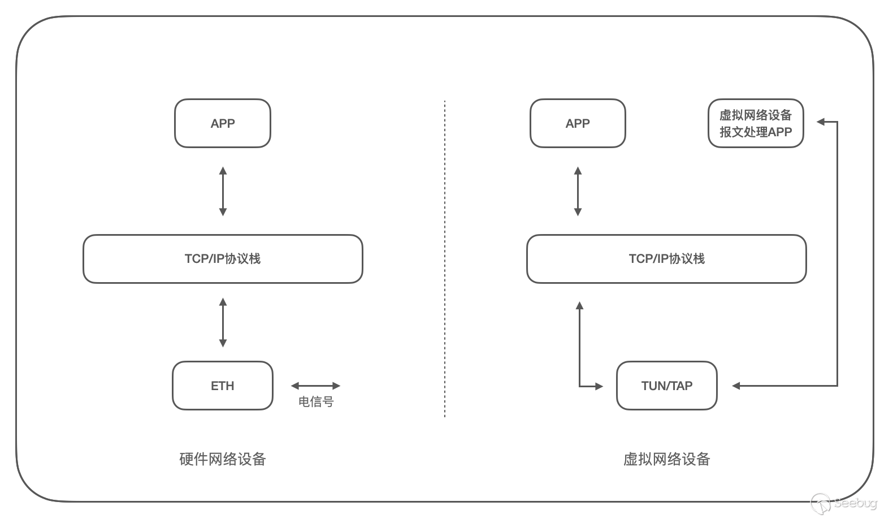

# 代理和VPN的区别

下面是我的理解：

代理是客户端借助代理服务器访问其他设备，VPN是客户端先和某个设备建立连接，然后把特定ip地址的数据包发送给VPN服务器，借助VPN服务器来访问特定ip地址。

VPN有代理功能，所以和代理有些功能重叠。

一般而言，VPN的工作原理是这样：

客户端设备A安装VPN客户端软件，需要填入VPN服务器地址、账号、密码，VPN软件使用IPSec和VPN服务器建立加密连接隧道，A访问某个特殊网段的ip，比如说公司内网ip，因为是内网ip，原本客户端是无法访问的，VPN软件检测到后，对此数据包做特殊处理，封装成另一种数据包，将封装后的包目的地址设置为VPN服务器的ip地址发送走，此包经过互联网传输后，VPN服务器收到这个包，解包，获取封装中的包的公司内网ip地址，将包转发过去，然后把内网设备回复的包再做封装，发回给A。

VPN可以通过tun来实现：

相对于代理，VPN往往有如下特点：

1. 链接加密，一般使用IPSec加密；
2. 只对某个网段的ip使用隧道传输，其他网段的ip不处理，所以一般用来访问公司内网；
3. VPN可以使用全局代理模式，从而把客户端的所有网络流量全部使用隧道传输到VPN服务器，此时相当于把VPN服务器当作代理来使用。

## 参考链接

[VPN 原理以及实现](https://paper.seebug.org/1648/)

