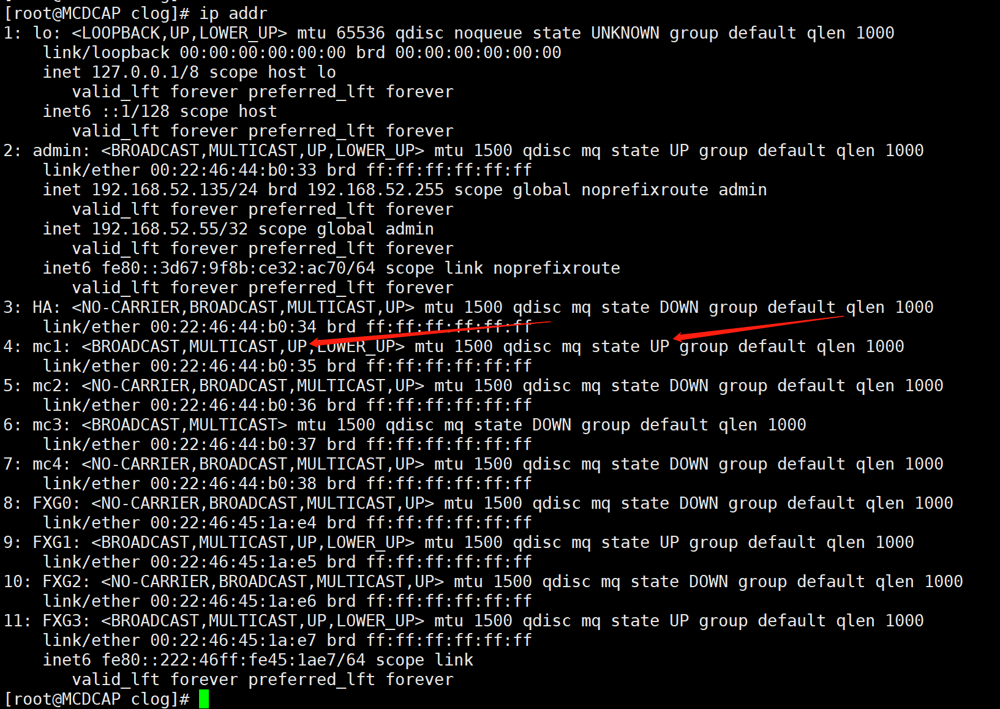

# 网络配置

**只有root用户可以在命令行下配置网络,其他用户可以在图形界面配置网络**


## 网卡配置文件

rhel6网卡的配置文件为/etc/sysconfig/network-scripts/ifcfg-eth0,里面的内容如下:

> DEVICE=eth0	设备名称
> TYPE=Ethernet	网卡类型（这时普通网卡，也会有无线网卡）
> HWADDR=xxxxx	网卡的mac地址
> ONBOOT=yes	是否开机启用网络连接
> NM_CONTROLLED=yes	network mamager的参数，修改完配置文件后实时生效，不需要重启，但必须/etc/init.d/NetworkManager服务正在运行才有效
> BOOTPROTO=static（none）/dhcp	设置为静态ip地址/设置为通过dhcp服务获取ip地址（如果通过dhcp获取的ip，下面的不用设置）
> IPADDR=192.168.2.10	设置ipv4地址
> NETMASK=255.255.255.0	设置子网掩码
> GATEWAY=192.168.2.1	设置网关
> DNS1=8.8.8.8	设置第一个dns
> DNS2=X.X.X.X	设置第二个dns


## 配置ip

1. 可以改网卡配置文件，再重启network 服务

```shell
/etc/init.d/network restart
#如果是systemd的系统,可以使用下列命令
systemctl restart NetworkManager.service
```

2. 也可以直接使用命令

```shell
ifconfig eth0 192.168.2.10/24
#或者
ifconfig eth0 192.168.2.10 netmask 255.255.255.0
```

> 24代表子网掩码24位,即255.255.255.0,子网掩码一段有8位


## 网卡的状态

```shell
ip addr
```



这里可以看到两个up，第一个UP代表网卡已经被操作系统上的用户或者软件启用了，如果没有启用，这里不会显示UP。在第一个UP的所在的尖括号中，还有一个LOWER_UP，这个LOWER_UP代表网卡上已经插线了，如果没有插线，这里会显示NO-CARRIER，即没有运输数据的载体。

如果想启用、关闭网卡，执行下面命令：

```shell
#启用网卡
ifconfig eth0 up/ifup eth0
#关闭网卡
ifconfig eth0 down/ifdown eth0
```

第二个UP代表代表网卡已经进入可以传输数据的状态了，插上网线这里不一定能显示UP，因为插上网线后，本地网卡需要和对端网卡协商一些信息，如果协商失败，本地网卡就不能和对端网卡传输数据，这里就不会显示UP。这里的信息是由网卡驱动提供的，如果网卡驱动没有提供相关信息，这里就会显示UNKNOWN，比如lo网卡。

另外两种查看网卡是否启用的方法：

```shell
ip link show up
ifconfig
# 如果网卡已启用，会在上面两个命令上显示，没激活的不显示
```

另外一种查看网卡是否插网线方法：

```shell
ethtool mc3
# 如果网卡插网线了，Link detected行值为yes，否则为no，如果这块网卡没有启用，无论插没插网线，这里都显示no
```

参考链接：

[linux - Unknown state of network interface - Super User](https://superuser.com/questions/1463162/unknown-state-of-network-interface)


## 查看DNS

1. 查看网卡配置文件
2. 查看dns配置文件

```shell
#nameserver行后的ip代表dns的ip
cat /etc/resolv.conf
```


## 改主机名

1. 改配置文件

```shell
#改HOSTNAME=参数，重启后生效
vim /etc/sysconfig/network
```

2. 通过命令,临时生效

```shell
hostname <newhostname>
```


## 查看网关

1. 看网卡的配置文件
2. 通过命令

```shell
#下面两个命令看Gateway列
route
netstat -r
#下面命令最后一行显示默认网关
ip route show
```


## 查看hosts

```shell
cat /etc/hosts
```


## /etc/host.conf文件解释

这个文件一般没有写权限,root用户也必须强制写入才可以

打开这个文件,内容如下:

> order bind,hosts			#指定域名解析查询顺序，这里规定先使用DNS来解析域名，然后再查询“/etc/hosts”文件(实际上大多数操作系统默认设置和这里相反)
>
> multi on					#指定允许“/etc/hosts”文件中指定的主机可以有多个地址，拥有多个IP地址的主机一般称为多穴主机
>
> ospoof on				#指不允许对该服务器进行IP地址欺骗。IP欺骗是一种攻击系统安全的手段，通过把IP地址伪装成别的计算机，来取得其它计算机的信任


## 复制的虚拟机无法获得ip不能启动网卡和复制的虚拟机重启网卡名总是变问题

在rhel6中,删除/etc/udev/rules.d/70-persistent-net.rules文件,删除网卡配置文件中关于mac地址的行,重启网络服务,解决

也可以通过这个配置文件解决虚拟机重启网卡名总是变的问题，在/etc/udev/rules.d/70-persistent-net.rules文件中，根据网卡mac地址和网卡名，增加

> SUBSYSTEM=="net", ACTION=="add", DRIVERS=="?*", ATTR{address}=="52:54:00:26:c8:8e", ATTR{type}=="1", KERNEL=="eth*", NAME="eth0"

重启，就能把网卡名和mac地址绑定上


## 网卡组包功能

网络数据包大小受MTU限制，应用层发送数据包时，如果没有开启网卡组包，应用层的数据传给网卡驱动时，会先按照MTU切割数据包再发给网卡驱动，这会消耗CPU资源，如果开启网卡组包，应用层数据不需要关注MTU，有什么数据直接发给网卡驱动，由网卡硬件对数据包按MTU切割，再发送出去，开启了网卡组包功能，会降低CPU负载。

应用层接收数据包时，道理类似。

注意，如果开启了网卡组包，libpcap抓包时抓上来的包就会出现非常大的包。

查看网卡组包有没有开启：

```shell
ethtool -k eth0
```

只需要关注下面一些选项

large-receive-offload

即LRO

开关方法：

```shell
ethtool -K eth0 lro on/off
```

generic-segmentation-offload

generic-receive-offload

分别比 LSO 和 LRO 更通用，自动检测网卡支持特性，支持分包则直接发给网卡，否则先分包后发给网卡。新的驱动一般用 GSO/GRO

开关方法：

```shell
ethtool -K eth0 gso on/off
ethtool -K eth0 gro on/off
```

tcp-segmentation-offload

udp-fragmentation-offload

很典型的，TCP 协议中就考虑了分片存在的情况，往往是切分 TCP 的数据包，叫做 TSO。而一般的情况，则称为 LSO 或者 GSO。

对于其他不支持切片的协议例如 UDP，则只能进行 IP 层上的切片

开关方法：

```shell
ethtool -K eth0 tso on/off
ethtool -K eth0 ufo on/off # 开启时试了一下提示失败，应该是我的网卡硬件不支持
```


# 网络工具的使用

## ethtool

-p/--identify 网卡名 [N]	点亮网卡上的灯,后面可以加点亮时间,没加就是一直亮

-k 网卡名	查看网络接口的offload特性

-K 网卡名 gro/tso/gso/tso on/off	打开关闭网卡的某个特性

## 调整pcap文件中顺序

如果一个名为in.pcap的包中的序号如下:

1,2,3,4,5,6

想调整成:

2,3,1,4,5,6

可以使用`editcap`和`mergecap`这两个工具,方法如下:

```shell
editcap -r in.pcap tmp1 2-3
editcap -r in.pcap tmp2 1
editcap -r in.pcap tmp3 4-6
mergecap -w out.pcap -a tmp1 tmp2 tmp3 
```

## ping

设置ping包大小并设置网络层不允许分片

linux下：

-s N		设置ping包大小为N

-M		do，禁止分片，即使包被丢弃

​			want，当数据包大小较大时在本地分片

​			dont，不设置分片标志（DF flag）

windows下：

-l N	设置ping包大小为N

-f		禁止分片


# 网络相关的内核参数

## ip转发功能ip_forward

ip转发是指A网卡收到数据包用B网卡转发出去。

linux发行版默认情况下是不开启ip转发功能的,可用下面命令查看,1为支持,0为不支持

```shell
sysctl net.ipv4.ip_forward
cat /proc/sys/net/ipv4/ip_forward
```

修改方法:

1. 通过命令临时生效

```shell
sysctl -w net.ipv4.ip_forward=1
#或者
echo 1 > /proc/sys/net/ipv4/ip_forward
```

2. 修改文件永久生效

```shell
#修改/etc/sysctl.conf,将net.ipv4.ip_forward的值设为1
vim /etc/sysctl.conf
#执行下面命令使之生效
sysctl -p /etc/sysctl.conf
#可以在红帽系列的发行版上可以通过重启网络服务使之生效
service network restart
#在debian/ubuntu系列的发行版则用这样的命令
/etc/init.d/procps.sh restart
```


## 数据包源路由校验rp_filter

Reverse Path Filter，反向路径过滤

这个参数是用来控制系统是否开启对数据包源地址校验的，校验发生在iptables的PREROUTING链后的路由选择处。

这个参数有三个值：

0 不做源地址检查

1 默认值，当一块网卡收到数据包后，内核会根据系统的默认路由表检查这个数据包的源ip能否从这块网卡上发出，如果发不出，就直接把这个数据包丢弃

2 当一块网卡收到数据包后，内核会根据系统的默认路由表检查这个数据包的源ip能否从这台设备发出，如果发不出，就直接把这个数据包丢弃

注意：如果自己新建了路由表，通过iptables对数据包打标，让这些数据包走自建的路由表，上面的操作系统检查不会检查自建的路由表。

这个值有三个地方保存

```shell
# 新建网卡（比如桥、tun/tap、veth等虚拟网卡）的默认值
net.ipv4.conf.default.rp_filter =1
# 取all.rp_filter和网卡名.rp_filter的或值，比如如果all.rp_filter为1，网卡名.rp_filter为0，那么系统就会启动源地址检查
net.ipv4.conf.all.rp_filter =1
net.ipv4.conf.网卡名.rp_filter =1
```


## 网卡响应ARP请求的配置arp_ignore

这个参数是用来控制网卡收到arp请求后是否响应的。

| 值   | 含义                                                         |
| ---- | ------------------------------------------------------------ |
| 0    | **(默认值)** 响应所有 ARP 请求。只要本机任何接口上有目标 IP，就回复。 |
| 1    | 只回复**目标 IP 地址**是**配置在接收到 ARP 请求的那个接口**上的 ARP 请求。 |
| 2    | 只回复**目标 IP 地址**是配置在接收到 ARP 请求的那个接口上，**并且**发送者的 IP 地址与接收接口在同一子网的 ARP 请求。 |
| 3    | 如果arp请求的目标地址是host类型不响应，如果目标地址是global或link类型响应。 |
| 4-7  | 保留值，未使用。                                             |
| 8    | **不回复任何arp请求**。                                      |

其中，0值和1值最常用。

2比1更安全，但网卡收到一个arp请求包，请求的ip地址是自己但包中的发送者ip和自己的ip不在同一子网的场景正常情况下遇不到，可能一些网络配置错误或者遭受攻击的场景才会遇到。

3没想到使用场景，ip地址的作用域scope分为host（lo口的127.0.0.1就是这种）、link、global，一般正常的使用的都是global。

修改办法：

```shell
echo "1" >/proc/sys/net/ipv4/conf/all/arp_ignore
echo "1" >/proc/sys/net/ipv4/conf/eth0/arp_ignore
# 或者
sysctl -w net.ipv4.conf.all.arp_ignore=1
sysctl -w net.ipv4.conf.eth0.arp_ignore=1
```

可以看到这个值在两个地方配置，实际生效的是net.ipv4.conf.all.arp_ignore和net.ipv4.conf.eth0.arp_ignore两者间的最大值。


**在lvs的DR模式中的应用**

在lvs的DR模式中，一定要把RS收包网卡的arp_ignore值设置为1，因为RS和DS在同一内网，DS的网卡和RS的lo口上配置了相同的vip，网关根据vip查找DS的mac地址时，会发送arp请求广播，RS收到了，它的lo口存在vip，如果它也回复了，就可能导致网关把目的地址是vip的包直接发到RS上了，就无法使用DS上的负载均衡了。


## 网卡发送ARP请求的配置arp_announce

arp_announce的作用是控制系统在对外发送arp请求时，如何选择arp请求数据包的源IP地址。


如果一个应用绑定了ip，那么这个应用发送的数据包的源ip就是确定的。

这个应用去访问其他设备的ip，那么发送的数据包的目的ip也是确定的。

根据目的ip查找路由表，那么发送网卡也是确定的，包下一跳的ip地址也是确定的（一般来说，目的ip和源ip同网段下一跳ip就是目的ip，否则就是网关）。

当前设备不知道下一跳ip的mac地址，就会发送arp请求，arp请求的源ip地址就是根据这个参数来确定的。

关于这个值，中文互联网上的解释都没有解释清楚，甚至还有错误的，非常难理解，英文原文如下：

> 0 - (default) Use any local address, configured on any interface.
>
> 1 - Try to avoid local addresses that are not in the target’s subnet for this interface. This mode is useful when target hosts reachable via this interface require the source IP address in ARP requests to be part of their logical network configured on the receiving interface. When we generate the request we will check all our subnets that include the target IP and will preserve the source address if it is from such subnet. If there is no such subnet we select source address according to the rules for level 2.
>
> 2 - Always use the best local address for this target. In this mode we ignore the source address in the IP packet and try to select local address that we prefer for talks with the target host. Such local address is selected by looking for primary IP addresses on all our subnets on the outgoing interface that include the target IP address. If no suitable local address is found we select the first local address we have on the outgoing interface or on all other interfaces, with the hope we will receive reply for our request and even sometimes no matter the source IP address we announce.

不过看英文原文，也解释的不清楚，不好理解，看3.10的内核源码就能明白这几个值的区别了，相关函数在arp.c的arp_solicit函数：

值为0时（默认值），直接使用需要发送arp报文的应用的源ip作为arp请求的源ip。

值为1时，会检查发送网卡上所有ip的子网，如果有一个子网既包含了需要发送arp报文的应用的源ip又包含了发送网卡下一跳的ip，就使用需要发送arp报文的应用的源ip作为arp请求的源ip，如果条件不满足，就按值为2的方式处理。

值为2时，尝试在发送网卡上寻找和发送网卡下一跳的ip同一个子网上的ip，如果找到了，就用这个ip作为arp请求的源ip，如果没找到，就用发送网卡上第一个scope为link或global的ip，如果还没找到（说明发送网卡上的ip都是host类型的），就遍历所有网卡上的所有ip，把找到的第一个scope为global的ip当作arp请求的源ip。


值为0场景：

设备有两块网卡：

eth0，ip地址：ip0，mac地址：mac0

eth1，ip地址：ip2，mac地址：mac1

应用绑定了ip0这个ip，访问其他设备时，根据路由策略，默认网关走的是eth1网卡，此时arp请求的源ip就是ip0，arp包从eth1上发出，源mac就是mac1。

这实际会带来一个问题：**收到这个arp请求的设备，会把ip0和mac1关联在一起。**

值为1场景：

设备有两块网卡：

eth0，ip地址：ip0，默认网关地址：gw_ip0，mac地址：mac0

eth1，ip地址：ip1，默认网关地址：gw_ip1，mac地址：mac1

应用绑定了ip0这个ip，

如果访问其他设备时，根据路由策略，默认网关走的是eth0网卡，下一跳的ip就是默认网关gw_ip0，gw_ip0和应用的源ip ip0在同一个子网，且都属于eth0的ip ip0的子网，此时arp请求的源ip就是ip0，arp包从eth0上发出，源mac就是mac0。

如果访问其他设备走的是eth1网卡，那么默认网关gw_ip1虽然和ip1在同一子网，但应用的源ip ip0不属于eth1的子网，就按级别2的方式处理。

值为2场景：

设备有两块网卡：

eth0，ip地址：ip0，默认网关地址：gw_ip0，mac地址：mac0

eth1，ip地址：ip1，默认网关地址：gw_ip1，mac地址：mac1

应用绑定了ip0这个ip，如果访问其他设备时，根据路由策略，默认网关走的是eth1网卡，在eth1上查找和gw_ip1相同子网的ip，找到了ip1，那么就用ip1作为arp请求的源ip，arp包从eth1上发出，源mac就是mac1。


修改办法：

```shell
echo "1" >/proc/sys/net/ipv4/conf/all/arp_announce
echo "1" >/proc/sys/net/ipv4/conf/eth0/arp_announce
# 或者
sysctl -w net.ipv4.conf.all.arp_announce=1
sysctl -w net.ipv4.conf.eth0.arp_announce=1
```

可以看到这个值在两个地方配置，实际生效的是net.ipv4.conf.all.arp_announce和net.ipv4.conf.eth0.arp_announce两者间的最大值。


**在lvs的DR模式中的应用**

在lvs的DR模式中，一定要把RS发包网卡的arp_announce值设置为2，这样保证了RS不会发出源ip是lo口的vip源mac地址是RS物理网卡的mac地址的arp包，从而避免其他设备把原本属于DR的vip和RS的发包物理网卡的mac地址关联上。

那为什么不能设置为1？看起来设置为1的话和设置为2的效果是一样的。

因为vip有可能和RS的物理网卡在同网段，如果设置为1，当vip去主动连其他设备时，RS物理网卡发出的arp请求的源ip是vip，源mac地址是物理网卡的mac地址，就会覆盖掉其他设备上arp表里保存的vip和DS的物理网卡的mac地址的映射关系。


