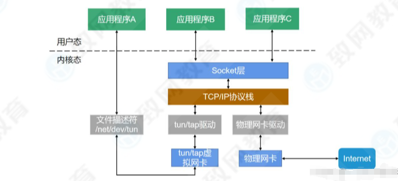
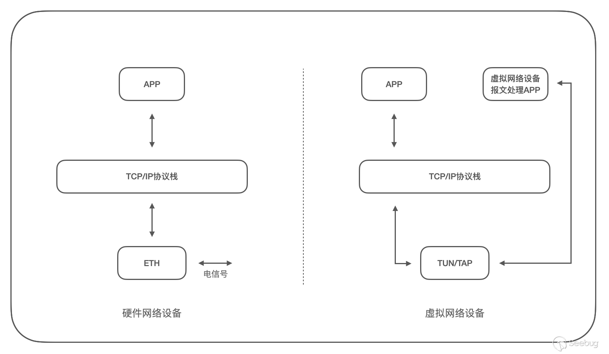
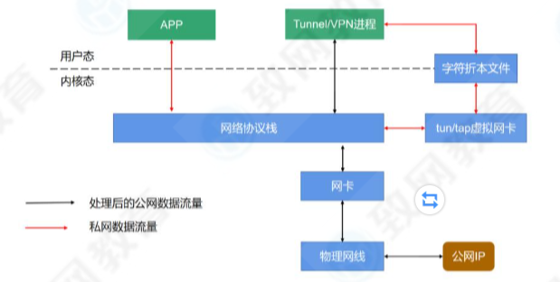
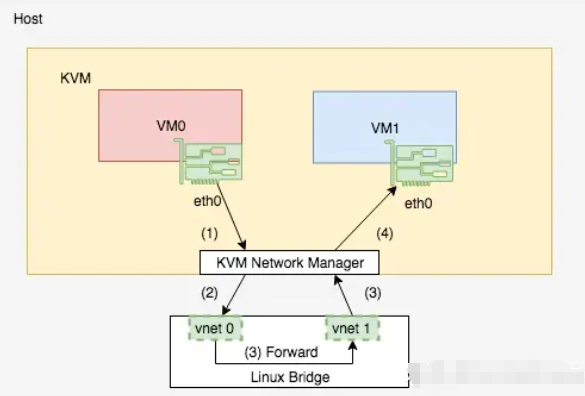
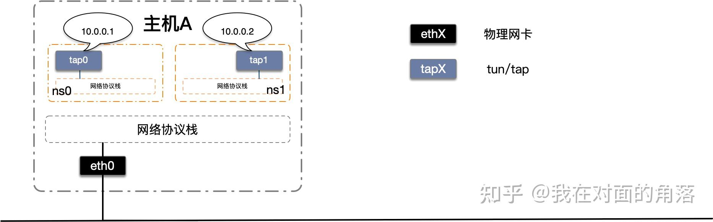
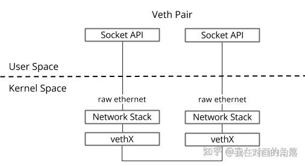
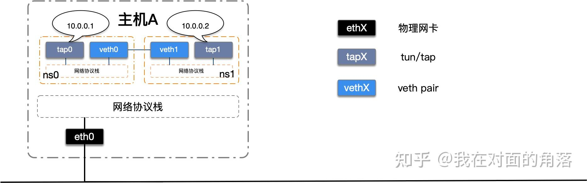
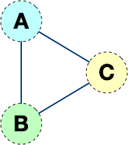
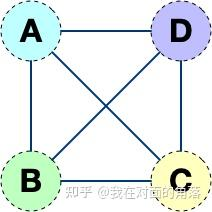
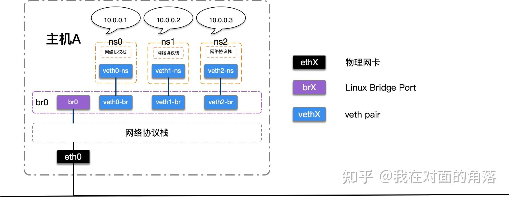

# 网络设备

和磁盘设备类似，Linux 用户想要使用网络功能，不能通过直接操作硬件完成，而需要直接或间接的操作一个 Linux 为我们抽象出来的设备，既通用的 Linux 网络设备来完成。一个常见的情况是，系统里装有一个硬件网卡，Linux 会在系统里为其生成一个网络设备实例，如 eth0，用户需要对 eth0 发出命令以配置或使用它了。更多的硬件会带来更多的设备实例，虚拟的硬件也会带来更多的设备实例。随着网络技术，虚拟化技术的发展，更多的高级网络设备被加入了到了 Linux 中，使得情况变得更加复杂。在以下章节中，将一一分析在虚拟化技术中经常使用的几种 Linux 网络设备抽象类型：Bridge、802.1.q VLAN device、VETH、TAP，详细解释如何用它们配合 Linux 中的 Route table、IP table 简单的创建出本地虚拟网络。


# 虚拟网络设备


虚拟网络设备是软件实现的网络接口，与物理网络设备不同，它没有物理硬件，只存在于操作系统的内存中，这些虚拟的网络设备全部用软件实现，并向运行于操作系统上的软件提供与硬件的网络设备完全相同的功能。虚拟网络设备可以用来模拟网络环境，进行数据包的捕获、分析和处理。

* 网络管理模块

在网卡驱动和内核协议栈之间，存在内核的网络管理模块。

对于硬件网卡收包来说，网卡收到包触发硬中断，根据中断向量表，调用网卡驱动的函数，驱动先禁用硬中断，再启用软中断，软中断处理函数之后、数据包送达到协议栈函数之前的处理流程，就属于网络管理模块。


## tun/tap



* 如何操作

Linux tun/tap可以通过网络接口和字符设备两种方式进行操作。

当应用程序使用标准网络接口socket API操作tun/tap设备时，和操作一个真实网卡无异。

当应用程序使用字符设备操作tun/tap设备时，字符设备即充当了用户空间和内核空间的桥梁直接读写二层或三层的数据报文。在 Linux 内核 2.6.x 之后的版本中，tun/tap 对应的字符设备文件分别为：

```text
tun：/dev/net/tun
tap：/dev/tap0
```

当应用程序打开字符设备时，系统会自动创建对应的虚拟设备接口，一般以tunX和tapX方式命名，虚拟设备接口创建成功后，可以为其配置IP、MAC地址、路由等。当一切配置完毕，应用程序通过此字符文件设备写入IP封包或以太网数据帧，tun/tap的驱动程序会将数据报文直接发送到内核空间，内核空间收到数据后再交给系统的网络协议栈进行处理，最后网络协议栈选择合适的物理网卡将其发出，到此发送流程完成。而物理网卡收到数据报文时会交给网络协议栈进行处理，网络协议栈匹配判断之后通过tun/tap的驱动程序将数据报文原封不动的写入到字符设备上，应用程序从字符设备上读取到IP封包或以太网数据帧，最后进行相应的处理，收取流程完成。

> 注意：当应用程序关闭字符设备时，系统也会自动删除对应的虚拟设备接口，并且会删除掉创建的路由等信息。

Linux 提供了一些命令行程序方便我们来创建持久化的tun/tap设备，但是如果没有应用程序打开对应的文件描述符，tun/tap的状态一直会是DOWN，还好的是这并不会影响我们把它当作普通网卡去使用。

使用`ip tuntap help`查看使用帮助

```text
Usage: ip tuntap { add | del | show | list | lst | help } [ dev PHYS_DEV ]
 [ mode { tun | tap } ] [ user USER ] [ group GROUP ]
 [ one_queue ] [ pi ] [ vnet_hdr ] [ multi_queue ] [ name NAME ]

Where: USER  := { STRING | NUMBER }
 GROUP := { STRING | NUMBER }
```

### tun

tunnel，虚拟出来的三层网络设备，如果根据路由表，包要通过这块网卡发出去，包会直接发到这块网卡上。

因为是三层网络设备，所以没有没有MAC地址，也没有ARP表的概念，即使不知道对端设备的Mac地址，包也会直接发到tun网卡上。tun网卡上也抓不到二层协议的ARP报文和广播。

常用于VPN等技术，由于工作在IP层，无法与物理网卡做bridge，但可以通过三层交换（如 ip_forward）与物理网卡连通。

如果要使用tun网卡，除了使用标准网络接口socket API操作，也可以直接open tun网卡的字符设备文件读写，读出来的数据是没有链路层的完整的IP数据包，写入的也必须是没有链路层的完整的IP数据包。参见这个300多行使用tun的极简例子：

[gregnietsky/simpletun: Example program for tap driver VPN](https://github.com/gregnietsky/simpletun)

举例：

```shell
# A主机
# 编译 simpletun
gcc simpletun.c -Wall -o vpn
# 作为 vpn server 启动，并开启 debug，默认监听 55555
sudo ./vpn -i tun0 -s -d
# 配置 tun 网卡地址
sudo ifconfig tun0 192.168.0.10 netmask 255.255.255.0

# B主机
# 编译 simpletun
gcc simpletun.c -Wall -o vpn
# 作为 vpn client 启动，连接 server，并开启 debug
sudo ./vpn -i tun0 -c 192.168.51.83 -d
# 配置 tun 网卡地址
sudo ifconfig tun0 192.168.0.11 netmask 255.255.255.0
```

运行原理：



A设备以服务端运行，B设备以客户端运行，运行后A、B设备上均新建了tun网卡，需要手动配个同网段的内网ip，B设备自动和A设备外网ip开放的端口5555连接建立socket。

B设备直接访问A设备tun网卡的ip时，数据先发到B设备的tun网卡，程序从tun网卡句柄上read到数据（在tun网卡上抓包可以发现，抓上来的包是完整的ip层及ip层之上的数据，不包含链路层数据，包内容见当前目录下/pcap/tun/tun0_test.pcap，包长度和程序打印的从tun网卡中读到的数据长度一模一样，说明此时从tun网卡读到的数据就是完整的ip层及ip层之上的原始内容）。

再把数据原封不动的write到socket的句柄，这样包就自动发送到A上了。

A程序读socket，把读到的数据原封不动写入tun网卡的句柄，这样A就获取到了B发送过来的数据。

#### 命令使用和实验

```shell
# 创建网卡并配置IP
ip tuntap add dev tun0 mode tun
ip link set dev tun0 up
ip addr add 10.0.0.1/24 dev tun0
ip route add 10.0.0.0/24 via 10.0.0.1
# 清除网卡
ip link set dev tun0 down
ip tuntap del dev tun0 mode tun
# tun设备创建成功后可以当作普通的网卡一样使用，因此我们也可以通过ip link命令来操作它，例如使用ip link命令也可以删除tun设备
ip link del tun0
```


#### 应用场景

Tun是一个网络层设备，支持点到点的网络通信，常用于tunnel隧道和VPN的构建，tunnel技术是网络设备把网络层数据包封装到另一个协议中以跨过网络传送到另一个网络设备的处理过程，主要用于公网主机和私有网络互联互通。在Linux系统中支持多种隧道技术，其底层实现原理都是基于Tun设备。

例如OpenVPN的路由模式就是使用了tun网络设备，OpenVPN Server重新规划了一个网段，所有的客户端都会获取到该网段下的一个IP，并且会添加对应的路由规则，而客户端与目标机器产生的数据报文都要经过OpenVPN网关才能转发。



### tap

TAP（Terminal Access Point，网络接入点） 是二层（数据链路层）的虚拟网络设备，主要用于以太网帧的处理。TAP 设备可以模拟一个以太网接口，能够接收和发送原始的以太网帧。这使得 TAP 设备可以与物理网卡做bridge，非常适合用于桥接不同的网络环境，或者在虚拟机中模拟物理网卡。

Tab是二层的设备，该设备有MAC地址，处理的是带有MAC地址的数据链路层的数据帧，从字符设备上读取的是数据链路层的数据帧，写入的也是这样的数据。

#### 命令使用和实验

```shell
# 创建 tap 
ip tuntap add dev tap0 mode tap 
# 删除 tap
ip tuntap del dev tap0 mode tap
# tap设备创建成功后可以当作普通的网卡一样使用，因此我们也可以通过ip link命令来操作它，例如使用ip link命令也可以删除tap设备
ip link del tap0
```


#### 应用场景

TAP接口的典型应用场景是在虚拟化网络中。例如，我们通过KVM创建的多个VM（虚拟机），以LinuxBridge（桥接网络）互通；实际上即是通过像vnet0这样的TAP接口来接入LinuxBridge的。在这种场景下，KVM程序就是向TAP接口读写数据的用户空间程序。当VM0向VM1的eth0接口发送数据，KVM会将数据发送到TAP接口vnet0，再通过LinuxBridge将数据转发到vnet1上。然后，KVM将数据发送到VM1的eth0口。



例如OpenVPN的桥接模式可以从外部打一条隧道到本地网络。进来的机器就像本地的机器一样参与通讯，丝毫看不出这些机器是在远程。如果你有使用过虚拟机的经验，桥接模式也是一种十分常见的网络方案，虚拟机会分配到和宿主机器同网段的IP，其他同网段的机器也可以通过网络访问到这台虚拟机。


### 参考连接

[Linux虚拟网卡TUN和TAP](https://www.cnblogs.com/yanchuanbin/p/18246678)


## network namespace

Network Namespace（以下简称netns）是Linux内核提供的一项实现网络隔离的功能，它能隔离多个不同的网络空间，并且各自拥有独立的网络协议栈，这其中便包括了网络接口（网卡），路由表，iptables规则等。例如大名鼎鼎的docker便是基于netns实现的网络隔离，今天我们就来手动实验一下netns的隔离特性。

### 命令使用和实验

要构建的网络如下：



```shell
# 添加并启动虚拟网卡tap设备
ip tuntap add dev tap0 mode tap 
ip tuntap add dev tap1 mode tap 
ip link set tap0 up
ip link set tap1 up
# 配置IP
ip addr add 10.0.0.1/24 dev tap0
ip addr add 10.0.0.2/24 dev tap1
# 添加netns
ip netns add ns0
ip netns add ns1
# 将虚拟网卡tap0，tap1分别移动到ns0和ns1中
ip link set tap0 netns ns0
ip link set tap1 netns ns1
# 查看网络命名空间
ip netns list
```

> 注意，`ip netns list`命令只能读目录`/var/run/netns`下面的数据，如果是docker容器创建的netns，不放在`/var/run/netns`下面，放在`/proc/docker容器进程号/ns/net`下，如果想用此命令查看，可以使用软链接，比如：
>
> `ln -s /proc/123624/ns/net /var/run/netns/28dc2e8853df`

在netns中执行命令有两种方式，一种是先在宿主机器上执行`ip netns exec <netns name> bash`进入netns，然后就可以像是在本机一样执行命令了。另一种是每次在宿主机器上使用完整的命令，为了明显区分，我们这里都使用完整的命令，例如`ip netns exec ns0 ping 10.0.0.2`的含义为在命名空间ns0中执行`ping 10.0.0.2`命令。

在不同的网络命名空间中移动虚拟网络接口时会重置虚拟网络接口的状态，所以移动虚拟网络设备后，需要up网卡。

```shell
ip netns exec ns0 ip link set lo up
ip netns exec ns0 ip link set tap0 up
ip netns exec ns0 ip addr add 10.0.0.1/24 dev tap0

ip netns exec ns1 ip link set lo up
ip netns exec ns1 ip link set tap1 up
ip netns exec ns1 ip addr add 10.0.0.2/24 dev tap1
```

### 参考链接

[Linux netns 详解](https://zhuanlan.zhihu.com/p/293659403)


## veth pair

veth pair是成对出现的一种虚拟网络设备接口，一端连着网络协议栈，一端彼此相连。如下图所示：



由于它的这个特性，常常被用于构建虚拟网络拓扑。例如连接两个不同的网络命名空间（netns），连接docker容器，连接网桥(Bridge)等，其中一个很常见的案例就是OpenStack Neutron底层用它来构建非常复杂的网络拓扑。

### 命令使用和实验

在上面netns的操作命令基础上继续实验。

使用veth pair将两个的隔离netns连接起来。如下图所示：



```shell
# 创建一对veth
ip link add veth0 type veth peer name veth1
# 将veth移动到netns中
ip link set veth0 netns ns0
ip link set veth1 netns ns1
# 启动
ip netns exec ns0 ip link set veth0 up
ip netns exec ns1 ip link set veth1 up

# 此时在ns0里还是ping不通ns1中的tap1，因为路由没有设置

# 查看路由
ip netns exec ns0 route -n
ip netns exec ns1 route -n

# 修改路由出口为veth
ip netns exec ns0 ip route change 10.0.0.0/24 via 0.0.0.0 dev veth0
ip netns exec ns1 ip route change 10.0.0.0/24 via 0.0.0.0 dev veth1

# 此时veth pair将两个隔离的netns成功的连接到了一起
# 在ns0中ping ns1中的tap1，可以ping通
ip netns exec ns0 ping 10.0.0.2
# 同理，在ns1中也可以ping通ns0中的tap0

```

但是这样的网络拓扑存在一个弊端，随着网络设备的增多，网络连线的复杂度将成倍增长。 如果连接三个netns时，网络连线就成了下图的样子。



而如果连接四个netns时，网络连线就成了下图的样子



如果有五台设备。。。

有没有什么技术可以解决这个问题呢？答案是有的，Linux Bridge（网桥）。

### 参考链接

[Linux veth pair 详解](https://zhuanlan.zhihu.com/p/293659939)


## bridge

Linux Bridge（网桥）是用纯软件实现的虚拟交换机，有着和物理交换机相同的功能，例如二层交换，MAC地址学习等。因此我们可以把tun/tap，veth pair等设备绑定到网桥上，就像是把设备连接到物理交换机上一样。此外它和veth pair、tun/tap一样，也是一种虚拟网络设备，具有虚拟设备的所有特性，例如配置IP，MAC地址等。

linux创建网桥的工具有很多种，传统的brctl、bridge、iproute2中的ip、NetworkManager的nmcli都支撑。

Linux Bridge通常是搭配KVM、docker等虚拟化技术一起使用的，用于构建虚拟网络，因为此教程不涉及虚拟化技术，我们就使用前面学习过的netns来模拟虚拟设备。

### 命令使用和实验

这里介绍使用brctl命令管理网桥。

```shell
# 新建网桥
brctl addbr <bridge>
# 添加一个设备（例如eth0）到网桥
brctl addif <bridge> eth0
# 显示当前存在的网桥及其所连接的网络端口
brctl show
# 启动网桥
ip link set <bridge> up
# 删除网桥，需要先关闭它
ip link set <bridge> down
brctl delbr <bridge>
# 或者使用ip link del 命令直接删除网桥
ip link del <bridge>
```

> 增加Linux Bridge时会自动增加一个同名虚拟网卡在宿主机器上，因此我们可以通过ip link命令操作这个虚拟网卡，实际上也就是操作网桥，并且只有当这个虚拟网卡状态处于up的时候，网桥才会转发数据。

在上一节veth pair我们使用veth pair将两个隔离的netns连接在了一起，在现实世界里等同于用一根网线把两台电脑连接在了一起，但是在现实世界里往往很少会有人这样使用。因为一台设备不仅仅只需要和另一台设备通信，它需要和很多很多的网络设备进行通信，如果还使用这样的方式，需要十分复杂的网络接线，并且现实世界中的普通网络设备也没有那么多网络接口。

那么，想要让某一台设备和很多网络设备都可以通信需要如何去做呢？在我们的日常生活中，除了手机和电脑，最常见的网络设备就是路由器了，我们的手机连上WI-FI，电脑插到路由器上，等待从路由器的DHCP服务器上获取到IP，他们就可以相互通信了，这便是路由器的二层交换功能在工作。Linux Bridge最主要的功能就是二层交换，是对现实世界二层交换机的模拟，我们稍微改动一下网络拓扑，如下图：



我们建立了一个网桥，三个netns，三对veth pair，分别一端在netns中，另一端连接在网桥上，为了简化拓扑，我去除了netns中的tap设备，将IP直接配置在veth上。

> veth设备不仅仅可以可以充当“网线”，同时它也可以当作虚拟网卡来使用。

```shell
# 添加网桥
brctl addbr br0
# 启动网桥
ip link set br0 up

# 新增三个netns
ip netns add ns0
ip netns add ns1
ip netns add ns2

# 新增两对veth
ip link add veth0-ns type veth peer name veth0-br
ip link add veth1-ns type veth peer name veth1-br
ip link add veth2-ns type veth peer name veth2-br

# 将veth的一端移动到netns中
ip link set veth0-ns netns ns0
ip link set veth1-ns netns ns1
ip link set veth2-ns netns ns2

# 将netns中的本地环回和veth启动并配置IP
ip netns exec ns0 ip link set lo up
ip netns exec ns0 ip link set veth0-ns up
ip netns exec ns0 ip addr add 10.0.0.1/24 dev veth0-ns

ip netns exec ns1 ip link set lo up
ip netns exec ns1 ip link set veth1-ns up
ip netns exec ns1 ip addr add 10.0.0.2/24 dev veth1-ns

ip netns exec ns2 ip link set lo up
ip netns exec ns2 ip link set veth2-ns up
ip netns exec ns2 ip addr add 10.0.0.3/24 dev veth2-ns

# 将veth的另一端启动并挂载到网桥上
ip link set veth0-br up
ip link set veth1-br up
ip link set veth2-br up
brctl addif br0 veth0-br
brctl addif br0 veth1-br
brctl addif br0 veth2-br
```

使用`ip netns exec ns0 ping 10.0.0.2`在命名空间ns0中测试与ns1的10.0.0.2的网络连通性，其他的依次类推。

不过在实验中，发现此时是ping不通的，看知乎文章上回复，还需要增加如下配置：

```shell
iptables -A FORWARD -i br0 -j ACCEPT
# 或者
echo 0 > /proc/sys/net/bridge/bridge-nf-call-arptables
echo 0 > /proc/sys/net/bridge/bridge-nf-call-iptables
echo 0 > /proc/sys/net/bridge/bridge-nf-call-ip6tables
```

原因是bridge_nf导致的，配置完成后，就可以ping通了。

### 参考链接

[Linux Bridge 详解](https://zhuanlan.zhihu.com/p/293667316)


### linux网桥不转发802.1D帧问题

IEEE的802.1D协议规定，网桥设备过滤01-80- c2 -00-00至01-80-C2-00-00-0F的MAC地址。

| MAC address       | Protocol                                     |
| ----------------- | -------------------------------------------- |
| 01-80-C2-00-00-00 | Spanning Tree (STP/RSPT/MSTP)                |
| 01-80-C2-00-00-01 | Ethernet Flow Control (pause frames)         |
| 01-80-C2-00-00-02 | Link Aggregation Control Protocol (LACP)     |
| 01-80-C2-00-00-03 | 802.1X Port-Based Network Access Control     |
| 01-80-C2-00-00-08 | Provider Bridge protocols (STP)              |
| 01-80-C2-00-00-0D | Provider Bridge protocols (MVRP)             |
| 01-80-C2-00-00-0E | 802.1AB Link Layer Discovery Protocol (LLDP) |

在linux2.6内核有一个设置，通过在/sys/class/net/bridge-iface/bridge/group_fwd_mask中设置一个特定的位掩码，来控制从IEEE 802.1D中定义的桥接器应该转发的范围内的哪个本地帧。默认值0表示Linux桥接器不转发任何链接本地帧。例如，将这个值设置为16384将允许桥接转发LLDP帧(01-80-C2-00-00-0E)：

```shell
echo 16384 > /sys/class/net/br0/bridge/group_fwd_mask
```

在默认内核发行版中，前三个MAC地址(-00、-01和-02)的位掩码值是受限制的，这意味着我们仍然不能使用这个技巧在我们的实验环境中启用STP和LACP协议。要删除这个限制，就需要自己对内核进行补丁并编译，就像EVE-NG中的人员所做的那样，或者直接使用EVE-NG编译好的内核。

group_fwd_mask掩码值：

| MAC  | 0F   | 0E   | 0D   | 0C   | 0B   | 0A   | 09   | 08   | 07   | 06   | 05   | 04   | 03   | 02   | 01   | 00   |
| ---- | ---- | ---- | ---- | ---- | ---- | ---- | ---- | ---- | ---- | ---- | ---- | ---- | ---- | ---- | ---- | ---- |
|      | 0    | 1    | 0    | 0    | 0    | 0    | 0    | 0    | 0    | 0    | 0    | 0    | 0    | 0    | 0    | 0    |

位掩码是一个16位的数字，其中第1位代表MAC地址01-80- c2 -00-00，第16位代表01-80-C2-00-00-0F。默认值(所有位都是0)不转发任何链接本地帧。为了能够转发特定MAC地址的帧，我们需要将对应的位设置为1。例如，为了允许转发LLDP帧(01-80-C2-00-00-0E)，我们需要将第15位设为1，其余的设为0，即二进制数：

0100 0000 0000 0000

转成十进制就是16384。如果想继续允许转发LACP (01-80-C2-00-00-02)和802.1X (01-80-C2-00-00-03)，我们也会将第3位和第4位设为1:

0100 0000 0000 1100

即16396，执行如下命令生效：

```shell
echo 16396 > /sys/class/net/br0/bridge/group_fwd_mask
```

